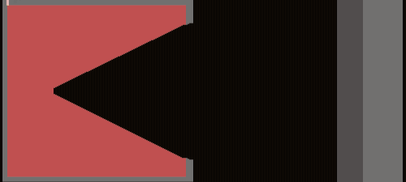
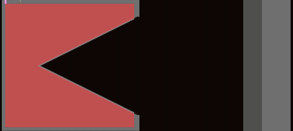
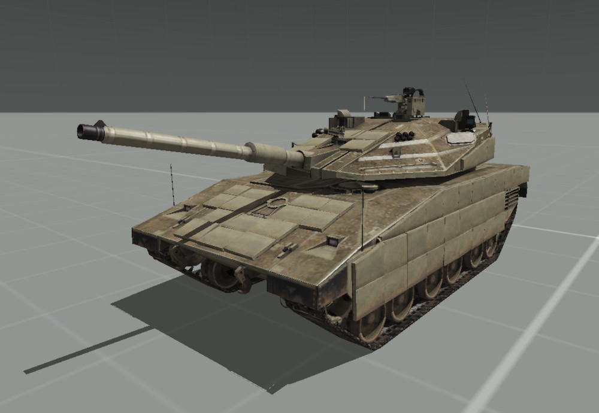
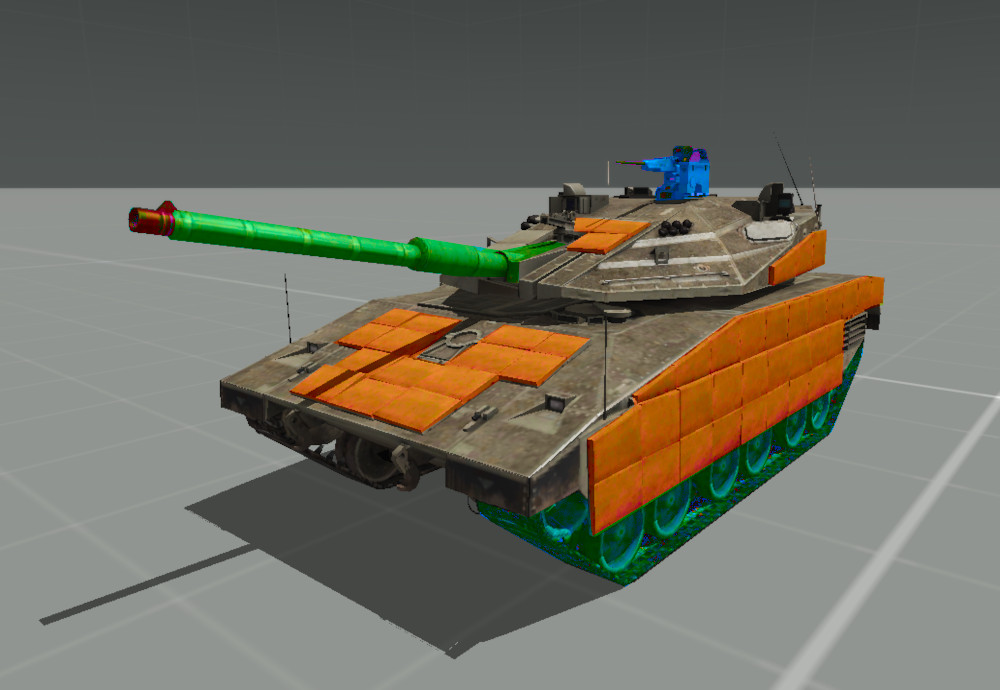
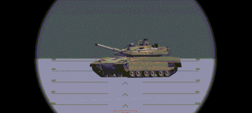
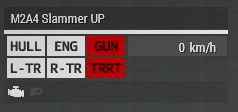
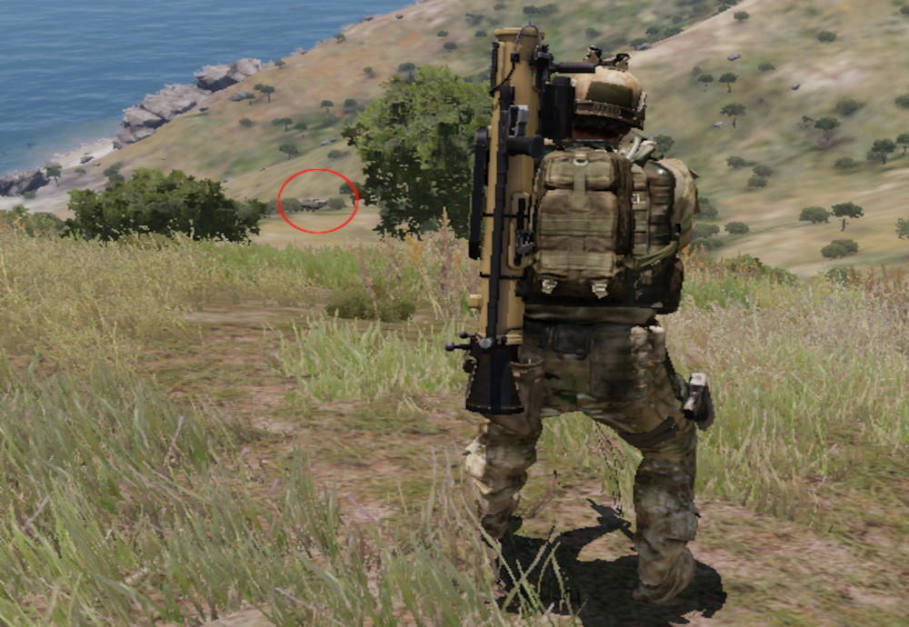
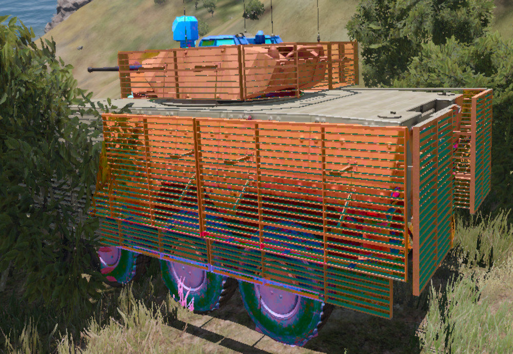
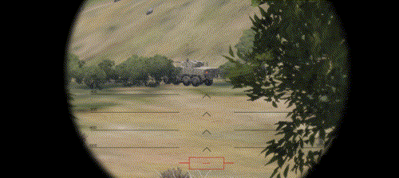

TFO Anti-Tank Guide

  

 
 

## Introduction  

This guide is aimed at providing theoretical training for Anti-Tank duties you may or may not need to fulfill during your time at Task Force Omega. It does not substitute an practical training - rather, this is complementary material to an in-game Basic AT Training (BATT). It is also designed to be required reading for those opting in as dedicated Anti-Tank soldiers, as opposed to those only taking basic Anti-Tank lessons.  

### Structure  

This guide is separated into few Chapters. Each contains several sub-headings. The last sub-heading of each Chapter will be _"The Rundown"_, giving a very quick explanation of the key takeaways from each chapter in bullet points.  

## Meet: The Chad Anti-Tank  
### Your Role  

As an Anti-Tank Soldier, you are part of a squad, which means you will be under the command of your direct leader - this will be your Squadlead. Your dedicated role is to respond to armored threats that pose a danger to the success of the mission.  

If multiple Anti-Tank Soldiers are operating within the same Squad, you may also be tasked with providing Rocket and/or Missile Ammunition to your fellow ATs.  

### Your Equipment  

Mostly, Anti-Tank duties are fulfilled trough infantry means - that is, a rocket launcher or missile launcher directly operated by you. However, stationary or motorized Anti-Tank solutions will also fall under your responsibility, if the mission calls for the use of such equipment.  

Rocket Launchers as well as Missiles are heavy and space-consuming. This is reflected in your loadout - compared to your Non-AT Teammates, you will often be equipped with smaller, weaker Weapons, like Submachine Guns, Personal Defense Weapons, or Carbines. Likewise, your Armor will be lighter, with less packing space. You will also most likely lack a sidearm.  

All of this is to compensate for the incredible weight that your dedicated AT equipment takes up. Lightweight guns, smaller magazines and lighter Armor will allow you to still fit in all equipment while being able to run at the same pace and stamina as your lighter teammates.  

Besides that, you will get the same operational equipment as your Squadmates: Radio, Bandages, Painkillers, Medicine, Night Vision, Smoke Grenades, so on. Your Rockets will go in a big, bulky backpack.  

|Category             | Contents             |                     |
|---------------------|----------------------|---------------------|
| Primary weapon      | SMG/Carbine          |                     |
| Primary ammo        | SMG mag x 8          |                     |
| Optic magnification | 1x-2x                |                     |
| Launcher            | Advanced AT Launcher |                     |
|                     |                      |                     |
|Throwables/explosives| **Day only**         | **Night Only**      |
|                     | 2x Frag              | 2x Frag             |
|                     | 3 white throwable    | 2-4x Blue Chemlight |
|                     |                      |                     |
| Medical             | 15x Packing          |                     |
|                     | 4x Tourniquets       |                     |
|                     | 1x Painkillers       |                     |
|                     | 1x Guedel tube       |                     |
|                     |                      |                     |
| Radio               | AN-343               |                     |
|                     |                      |                     |
| Misc                | 2 Cable ties         | IR strobe           |
|                     | Earplugs             |                     |

### Idle Priority  

Unless an armored target is within view, your priority will mostly be to survive. To elaborate: You are part of a squad and will therefore take orders of your Squadleader, like any other member of your squad - but there are certain limitations putting you in a riskier position than that of your squadmates.  

Your range of engagement will most likely be outmatched by the person you're trying to shoot. Your Armor will be lighter and your stamina will be depleted faster than you can scream "get to cover". To make matters even worse, enemies will see you as a priority target and most likely target you foremost, similar to Medics and Autoriflemen. And once you're out, your team will be all open for an all-you-can-eat-120mm-buffet.  

Essentially, priority is to stay in cover and use your gun as means of suppression rather than frontline combat. If there is an easy infantry target you can take out without taking a risk yourself, go for it - but mostly, you wanna stay behind.  

### Tank Priority  

Once an armored enemy vehicle is spotted, it will be your time to shine. Above all, your priority will be to remove the target as a threat to the squad and/or the operation: If you disable the tank's gun and it can no longer fire it's weapon, it's threat is erased. Similarly, you can destroy the tank tracks or the engine to get it stuck in a position where it can no longer engage your team.  

Target the right spots (see section down below) to destroy the parts that the enemy vehicle crew relies on the most to tear your squad apart. If you can destroy the tank with one Rocket, go ahead - but if you are unsure, it's best to target individual parts and disable them.  

### The Rundown  

*   As an Anti-Tank-Soldier, your role is to destroy enemy Armor.  
    
*   You will be slower and more vulnerable than your teammates, so stay in cover.  
    
*   Prioritize tank disabling over tank destruction.  
    
*   Disable whatever tank parts worry you most about in the current engagement.  
    

## On Destroying Tanks  
### Understanding Explosion Physics  

To understand how to effectively disable tanks, we must understand how exactly a rocket deals damage to a tank. It's not just the explosion that deals damage to the tank - if that were the case, we could just use a big enough grenade, right?  

  

*(Animated Fig. 1: Ignited TNT in an Iron Shell, resembling a primitive rocket impact. Note how the force wears out the armor equally.)*

An uncontained explosion disperses it's force in all directions. This is unfavorable - we want all the force we can possibly get to direct onto the tank. To achieve this, the explosives inside of the Rocket/Missile form a shape similar to an inverted cone. This is called the "Munroe effect".

  

*(Animated Fig. 2: Ignited shaped TNT in an Iron Shell. Note that despite using less explosives than in Fig. 1, it pierces more armor due to a focused blast.)*

To finish the equation, a final element is added to the shaped charge: A thin copper lining forming along the charge. Upon detonation of the explosive, the copper proceeds to melt due to intense heat. The force proceeds to push the molten copper into the middle of the rocket, forcing it into a metal spear. Nowhere left to go but forward, the molten metal lance pushes forward at supersonic speed, effectively piercing the armor.

  

*(Animated Fig. 3: Ignited shaped TNT with added metal lining in Iron Shell. Note that the charge now manages to pierces trough both layers of armor.)*

The copper punches trough the armor and attacks whatever lies beneath the surface. With the armor out of the way, the remaining force of the explosion makes it way into the armored vehicle as well.  

The takeaway from this physics lesson is that you fight armored vehicles with focused power instead of raw explosion. Much like you would target the head of an enemy combatant to have a 1-shot-one-kill-impact, you will aim the Rocket at e.g. the hull to tear trough the engine and stop the enemy vehicle.  

(Note that this explains the workings of a HEAT rocket with a single warhead. Different missile types, such as ones with multiple warheads, or squash charges, exist.)  

### Understanding Vehicle Parts  

Now that we know that rockets penetrate armor to disable internal components, we must know what components to aim for in order to deal damage to a tank. Any odd shot will do nothing but add additional ventilation to the tank - critical strikes are paramount to successful counter-armor.  

ArmA 3 denotes damage to an vehicle into 6 different categories:  

*   **Hull**: Chassis & Armor, excluding inner parts/mechanics. A damaged hull will reduce the protection offered to everything inside of it, allowing weaker calibers/forces to penetrate the armor. Note that, in ArmA 3, the hull is still a specific armor point on the vehicle, and not the overall chassis of the vehicle.  
    
*   **Engine**: The component generating power for propulsion and light. A damaged engine will accelerate slower and have a limited speed, a destroyed one will cease to work.  
    
*   **Fuel Tank**: Compartment for storing fuel, which is consumed by the engine. A raptured fuel tank will slowly leak fuel over time, a destroyed one will empty itself within seconds.  
    
*   **Wheels**: The factor driving power from the engine onto the ground, moving the vehicle forward. If they are destroyed or damaged, they will not be able to do this task efficiently, ultimately slowing down the vehicle or getting it stuck.  
    
*   **Gun**: Means of offensive for the armored vehicle, mounted on the turret. A destroyed gun barrel will not be able to move upwards or downwards.  
    
*   **Turret**: Rotating platform mounted on top of the vehicle, used to aim armaments. A damaged turret will, like a damaged hull, offer reduced protection. A destroyed turret will not be able to turn, and will offer even less protection.  
    

Whichever of these to aim for will depend on the situation of the engagement and armor configuration of the enemy vehicle (see chapter below).  

Wherever these weak spots are positioned and how well they are armored are also dependent on the vehicle itself. One tank may position it's fuel tank in the front to protect crew members, while the other will conceal it in the back behind reactive armor.  

### Understanding Vehicle Damage  

It is crucial to understand that ArmA 3 assigns each individual part of an armored vehicle (as listed in the chapter above) an individual armor value. While these basically represent their health (where 0 equals destroyed), they are armor in the literal sense that they they need to be penetrated by a suitable weapon in order to be reduced.  

The vehicle also has it's own base armor value. This is essentially it's own health pool, which is drained if damage is done, but not to any specific part. If it drops to 0, an catastrophic kill (which is an explosion of the vehicle) occurs.  

Individual armor parts can carry special properties with them:  

*   Some armored parts can cause a **catastrophic kill if destroyed****.** In many cases, a breach of the "hull" part will cause a catastrophic kill.  
    
*   Some armored parts **transfer a percentage of damage** **to the main vehicle base armor****.** Engines often do this, where the BTR-K Kamysh's engine negates 20% of taken damage to the vehicle health pool.  
    
*   Some armored parts have **added resistance or vulnerability to HE Projectiles.** Often, Slat armor has increased vulnerability to HE Rockets.  
    

Each tank configures and places these Armor parts differently, making these Values and Properties hard to guess, especially within modded ArmA 3 content. However, just acknowledging that such properties is important, as it adds an important factor in choosing which part of the tank to target.  

### Understanding Armor Types  

Tanks, in real life as well as in ArmA, utilize various armor technologies to protect themselves against threats. You might need to disable a layer of armor using a specific rocket type before being able to attack a critical spot. Provided below is a short overview of the different types you'll encounter within the realm of ArmA 3:  

*   **Composite Armor** is the armor that makes up the hull surface of newer tanks. Since shaped charges can even penetrate multiple centimeters of steel armor, a new type of armor was needed. While still very vulnerable if not combined with other armor types, a composite armor hull now has the chance to reduce the impact of a shaped charge. While penetration varies with thickness of applied composite armor, it can most often be penetrated with 2 successive hits on the same spot.  
    
*   **Slat Armor** are metal cages or grids often mounted to the sides of the armored vehicle, creating a gap between the cage and the composite armor. Should a rocket hit the cage, it is detonated early, negating the effect of the shaped charge (See Chapter "Understanding Explosion Physics") within the rocket. Slat Armor is often destroyed after the first contact, but toughness can vary.  
    
*   **Reactive Armor** is armor composed of high explosives sandwiched between two armor plates. On contact with a rocket, these charges launch an explosion in the opposite direction. This serves to disrupt the penetration path of the metal lining of a HEAT, effectively negating it's force. This type of Armor comes in different forms and works against different types of rockets, but the single-use ERA is the most common contender. ERAs are destroyed after first contact.  
    
*   **V-Hull-Armor** is armor mounted below the vehicle in a V-Shape. It redirects the upward-facing explosive force of IEDs and Mines away from the passengers, increasing the chance of the personnel within to survive the attack. V-Hull-Armor is often destroyed after first contact, but toughness can vary.  
    
*   **Smokescreens** are manually deployed by the vehicle commander by engaging a system that launches multiple smoke grenades either in front or around the armored vehicle. While they provide no ballistic protection, in ArmA 3, they disable the lock-on capabilities for fire-and-forget systems (even infrared ones), which requires direct line of sight. Smokescreens are temporary and disappear shortly after initial deployment.  
    
*   **Camo Nets** are nets covered with leaves in the color of the surrounding area, used to hide the vehicle by blending in. They do not provide any ballistic protection whatsoever, but can provide visual cover for Reactive Armor, mitigating a fatal first strike due to misjudgment.  
    

These armor types can be used in parallel to offer a higher grade of defense to the vehicle & crew. Identifying, avoiding and/or destroying these armor parts is crucial to effectively attack armored vehicles.  

### Understanding targeting  

With that all of the way, we can finally use all of these variables to calculate the equation this chapter is covering: Where do I target a tank to deal the most damage, and, thus, destroy it?  

For this chapter, we will look at a few situational examples, highlight the visible armor, and make our decision based on all the points previously learned.  

All of the examples mentioned here will use the _"MAAWS MK4 Mod 1"_ as the Anti-Tank Weapon of choice, and, unless stated otherwise, the _"MAAWS HEAT 75 Round"_ as the ammunition.  

#### Example #1 

You have to engage an _M2A4 Slammer_, Urban Purpose Variant, at an angle of 45 Degrees at the range of 100 Meters. There is nothing obstructing your view and the tank has not discovered you yet.  

  

*(Fig. 4: M2A4 Slammer (Urban Purpose) facing 45 Degrees left from camera.)*

Let's analyze the weakpoints we will be able to hit & penetrate from this perspective, as well as the armor that we should avoid.  

  

*(Fig. 5: M2A4 Slammer. Reactive Armor is marked in orange, the turret in green, the Commander's Remote-Operated Machinegun in Blue and the Threads in Cyan.)*  

As for armor, the tank is encased entirely in composite armor. Additionally, the tank has a portion of it's front, side and threads covered up with reactive armor. Weakpoints recognizable with the bare eye from this angle are the gun, turret, HMG and threads.  

Since a catastrophic kill within the first shot is highly unlikely, we now need to balance risk and potential damage to decide what weakpoint to aim for:  

*   **The threads** are mostly covered up with reactive armor, making a hit there too risky, with too little damage tradeoff - the tank can still move and steer using the undamaged tracks on the other side.  
    
*   **The HMG** is even more difficult to aim for, and does even less to disable the tank. The HMG is a minimal nuisance in this combat situation, considering it can be avoided with hard cover.  
    
*   Targeting **The Gun** will provide ideal damage for a first strike. If we aim at the gun manlet (the part that connects gun and turret), we will have a spot to strike that has a chance of damaging the Gun and Turret, is minimally protected by reactive armor and is also easy to hit.  
    

With the target analysis out of the way, we aim our rocket launcher, aim for the tank gun manlet, clear our backblast, and fire.  

*(Animated Fig. 6: M2A4 Slammer engaged at it's gun manlet at a range of 100 meters.)*

The damage did not cause an catastrophic kill. However, that does not have to mean the blast was without damage - let's check the dashboard for the M2A4's status after the initial strike.

]

*(Fig. 7: M2A4 Slammer's Status Dashboard after Engagement.)*  

This strike has successfully penetrated and completely disabled the Gun of the vehicle as well as it's turret, making it unable to fire or turn it's main turret. In a combat situation, only the vehicle's HMG would now be a threat, whose commander is most likely still overwhelmed by the attack.  

The next course of action would be to fire another rocket at any of the other mentioned weakpoints (or the same again), until a catastrophic kill or a crew dismount occurs.  

#### Example #2  

.You have to engage an _AMV-7 Slammer_, at an angle of ~270 Degrees at the range of 320 Meters. The IFV has not discovered you yet, but it's entire front is obstructed by foliage. Yo do have an height advantage, as you are engaging the armored vehicle from a nearby hill.  

  

*(Fig. 8: An AMV-7 at a range of 320 meters, hiding between bushes.)*  

Let's, again, analyze the weakpoints we will be able to hit & penetrate from this perspective, as well as the armor that we should avoid.  

  

*(Fig. 9: An AMV-7 Marshall. Slat Cages are marked in orange, the commander's hatch and camera in blue and the exposed wheels in violet.)*  

This AMV-7  has decided to hide behind a bush, making it unable for us to analyze any weakpoints at the front of the vehicle from this angle. The back of the vehicle is heavily armored with slat cages, which need to be penetrated with a single rocket first before exposing the composite armor below. The same goes for the turret, which as it's sides and back covered by slat armor. The vehicle is fitted with composite armor, however, it is probably much weaker than that of a main battle tank.  

The only weakpoints recognizable with the bare eye are the wheels and the commander's hatch. Both have a limited unarmored surface exposed to us, as they are positioned closely to Slat cages nearby.  

Even less so than the first example scenario, a catastrophic kill on the first shot seems unlikely. Therefore, we must again decide what part to aim for on a basis of risk and reward:  

*   **The Wheels** are almost completely covered up by Slat armor. An High-Explosive Rocket might be able to take all of them out if the rocket is aimed low enough. This will have no huge advantage, however, as the damage is minimal and the vehicle will then be aware of our presence, attacking us without hinderance, making this sort of engagement too risky.  
    
*   **The commander's hatch** and the additional **camera** are very unlikely to be hit. Even if a hit would occur, and damage would be dealt to both components, this would not do any critical damage to the tank - at best, it would kill the commander and disable the camera, leaving the driver and gunner do coordinate between themselves.  
    
*   The only other considerable option (that does not display an obvious weakpoint, however) would be **rear** **section of the hull**. This is the only section of the IFV the tank would be immediately able to penetrate without having to deal with a slat cage first. It would then damage or destroy any components beneath.  
    

While none of these options seem truly optional, **the only section our rocket is able to penetrate is the rear section** - attempts to take out either the wheels or the commanders hatch would end in a fluke, trading a rocket and situational advantage for a disabled Slat cage.  

With that, we adjust the aim of our rocket launcher for range, clear our backblast, and fire:  

  

*(Animated Fig. 10: AMV-7 Marshall engaged at it's rear hull at a range of 230 meters. Notice the catastrophic kill.)*  

The damage of the rocket, surprisingly, caused a catastrophic kill. This is because the AMV-7 Marshall design places it's fuel tank in the rear of the vehicle, sandwiching the passenger compartment between two fuel tanks placed near the sides of the vehicle. Our Rocket penetrated those fuel tanks from above, and the consequent damage to the vehicle's main health pool caused a critical kill.  

## The Rundown  

*   The penetration of the rocket deals damage, not the explosion.  
    
*   ArmA 3 tracks vehicle damage by calculating damage based on a vehicle health pool as well as damage dealt to vehicle parts.  
    
*   ArmA 3's individual Vehicle parts can have certain attributes that makes damaging the vehicle either easier or more challenging.  
    
*   Vehicles utilize a wide array of different armor types to protect themselves - they need to be avoided or destroyed in order to effectively engage a vehicle.  
    
*   All of these factors play a huge role in how you will engage a vehicle shall the need arrive.

