

TFO Mission Maker Guide

  

  
 
 

# Presentation

This guide aims to assist the mission maker on how to **prepare missions** on Arma III as TFO requires them. It provides information on how to set up settings, scripts, prepare modlists, player layouts and many more.

## 1. Mods

Mods are the sinews of war, they take an important place in the gameplay. 

This is why it is **fundamental to test them first**, make sure they **work properly** _(including their ACE compatibilities)_, before starting to create modlists or missions, as some of them can be **outdated**, **broken** or **badly optimized** _(AMF)_.

- **Test mods and compatibilities**

## 2. Modlists

After testing mods, it is time to create modlists. Beware, it is **imperative to create multiple modlists as they don’t fulfill the same role**. Modlists must be kept as small as possible to prevent issues _(mod count & size)_. You can’t use the same modlist for playing and creating the mission, as some mods, ex. TFO repack, contains mods that create dependencies.

By the way how TFO plays and operates, there are **mods that are always required** : 

- CBA\_A3
- ace
- ACRE2
- Gruppe Adler Trenches
- KAT - Advanced Medical REWRITE
- TFO Briefing UI
- TFO Repack

If you have a doubt about if a mod is only client side or server and client side, usually you can find **information in the description of the mod’s workshop page**, or you can ask in the missionmaker chat.

When your modlists are done, **make sure it is available as soon as possible before the op**, especially if new mods need to be downloaded.

When exporting your modlists, **remember to put “Arma 3 Preset” in the name**, without underscore or else _(ex. Arma 3 Preset TFO US Army)_, so when importing the modlist, the player will have the right name in the Arma launcher _(TFO US Army, instead of Imported preset)_.

3 versions of modlists are needed _(exemple below)_ :

- **Mission making :** Contains mods required by the mission plus for the creation of the mission
- **Server :** Similar to the mission making modlist, but can include mods needed by the server        
- **Player :**  Have additional mods only needed by the player

Here’s an example of modlists made for a previous TFO US Army campaign : 

| Mission making                     | Server                             | Player                             |
| ---------------------------------- | ---------------------------------- | ---------------------------------- |
| CBA_A3                             | CBA_A3                             | CBA_A3                             |
| ace                                | ace                                | ace                                |
| ACRE2                              | ACRE2                              | ACRE2                              |
| Anizay                             | Anizay                             | Anizay                             |
| Community Factions Project (CFP)   | Community Factions Project (CFP)   | Community Factions Project (CFP)   |
| CUP ACE3 Compatibility - Vehicles  | CUP ACE3 Compatibility - Vehicles  | CUP ACE3 Compatibility - Vehicles  |
| CUP ACE3 Compatibility - Weapons   | CUP ACE3 Compatibility - Weapons   | CUP ACE3 Compatibility - Weapons   |
| CUP Terrains - Core                | CUP Terrains - Core                | CUP Terrains - Core                |
| CUP Units                          | CUP Units                          | CUP Units                          |
| CUP Vehicles                       | CUP Vehicles                       | CUP Vehicles                       |
| CUP Weapons                        | CUP Weapons                        | CUP Weapons                        |
| Gruppe Adler Trenches              | Gruppe Adler Trenches              | Gruppe Adler Trenches              |
| Hendrix US Army Vest               | Hendrix US Army Vest               | Hendrix US Army Vest               |
| Jbad                               | Jbad                               | Jbad                               |
| KAT - Advanced Medical REWRITE     | KAT - Advanced Medical REWRITE     | KAT - Advanced Medical REWRITE     |
| LAMBS_RPG                          | LAMBS_RPG                          | LAMBS_RPG                          |
| LAMBS_Suppression                  | LAMBS_Suppression                  | LAMBS_Suppression                  |
| LAMBS_Turrets                      | LAMBS_Turrets                      | LAMBS_Turrets                      |
| One Man Army Mortar Pack           | One Man Army Mortar Pack           | One Man Army Mortar Pack           |
| ACE Compat - RHS USAF              | ACE Compat - RHS USAF              | ACE Compat - RHS USAF              |
| RHSUSAF                            | RHSUSAF                            | RHSUSAF                            |
| USAF Mod - Main                    | USAF Mod - Main                    | USAF Mod - Main                    |
| USAF_AC130_BETA                    | USAF_AC130_BETA                    | USAF_AC130_BETA                    |
| Zeus Enhanced                      | Zeus Enhanced                      | Zeus Enhanced                      |
| Zeus Enhanced - ACE3 Compatibility | Zeus Enhanced - ACE3 Compatibility | Zeus Enhanced - ACE3 Compatibility |
| 3den Enhanced                      | Deformer                           | Bloodlust (Edit)                   |
| Deformer                           | Injured AI                         | Escape From Tarkov Footsteps       |
|                                    | Splendid Smoke                     | Escape From Tarkov Weapon Sounds   |
|                                    | TFO Briefing UI                    | JSRS SOUNDMOD                      |
|                                    |                                    | Splendid Smoke                     |
|                                    |                                    | TFO Briefing UI                    |
|                                    |                                    | TFO Repack                         |

Mods required :

- **By the mission**
- **For making the mission**
- **For making the mission and by the server**
- **By the server**
- **By the server and the client**
- **By the client**

<!---->

- **Keep modlist small as possible**
- **Use required mods**
- **Make sure modlist is well in advance available before the op**
- **Create different modlists for different uses**
- **Put Arma 3 Preset in the modlist name**
  

## 3. Mission settings

When the modlists are ready, it is time to create the mission. But before starting, it is **important to configure the settings of the mission properly** to prevent any issues.

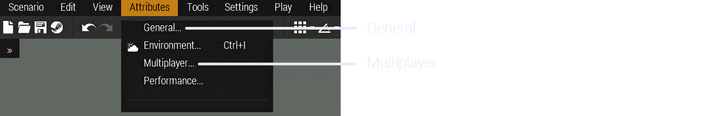

### General 

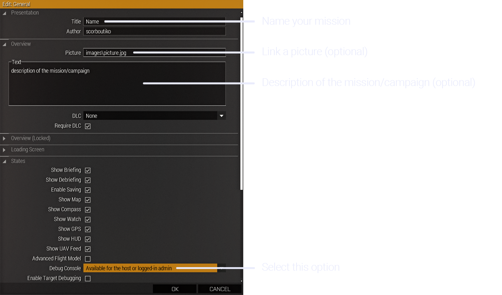

### Multiplayer 

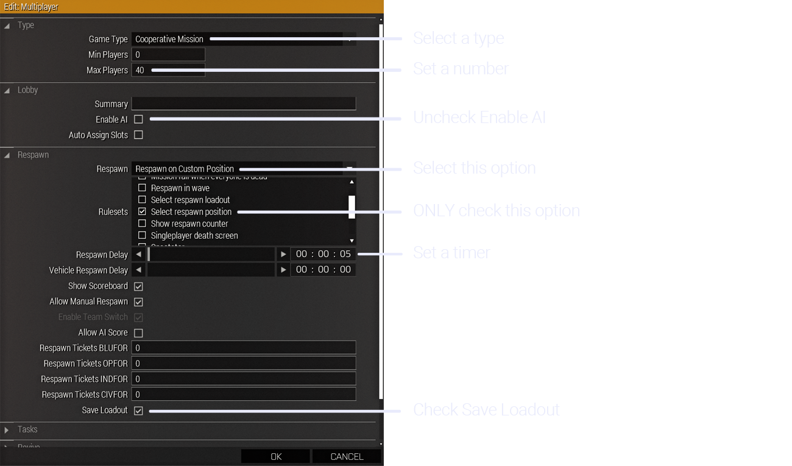

## 4. Player layout and loadouts

### Player layout 

We need a **specific player layout** according to our sign up sheets [**HERE**](https://docs.google.com/spreadsheets/d/1rDYccbTh8AwkFsf8eH5Uo9JXZpjnM2buKw_GWrxnPt0/edit##gid=1153113922). To get this player layout in Arma with the correct configurations, a composition is available on the workshop : 

[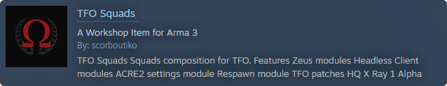](https://steamcommunity.com/sharedfiles/filedetails/?id=2891659177)

A version with premade loadouts is also available here : 

[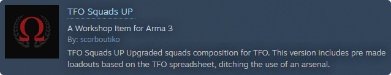](https://steamcommunity.com/sharedfiles/filedetails/?id=2945266531)

**What is this version for ?**

Every equipment required per special role are **already included** in the uniform and backpack _(Radios, medical, grenades, tools…)_. All the rest _(weapons, launcher, ammo, vest and helmet)_ are up to the missionmaker to put whatever wanted for the mission. Uniforms and backpacks can be changed to **similar size capacity gear** _(sort by capacity to make it easier)_, to fit the faction played.

**Notes :**

Platoon leader, squad leaders, JTAC/FO and grenadiers already have 40mm grenades on them. Giving them a weapon without a grenade launcher **will remove those grenades from their inventory**. So when making their loadouts, make sure to **directly give them a weapon mounted with a grenade launcher** _(ex. M4 with M203)_.

- **Use TFO squads composition**
 

### Callsigns

In order to have the teams names properly showing on the map, **their callsigns needs to be changed manually** in the “Lobby Manager” in “Tools” _(only available with 3den Enhanced)_, as the composition doesn’t save them. 

 

A simple but **necessary** process that needs to be done to every teams, by copying the name in “Role Description” and pasting it in “Callsign” : 

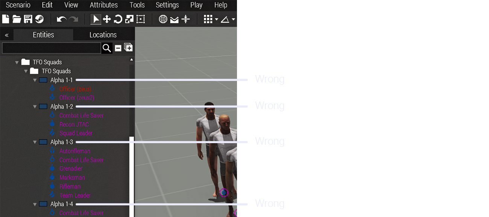
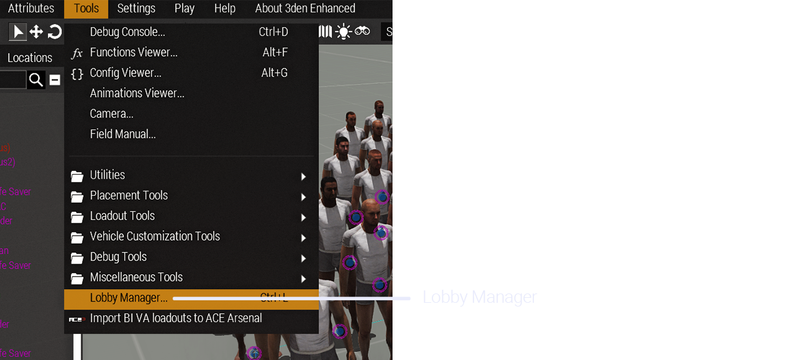
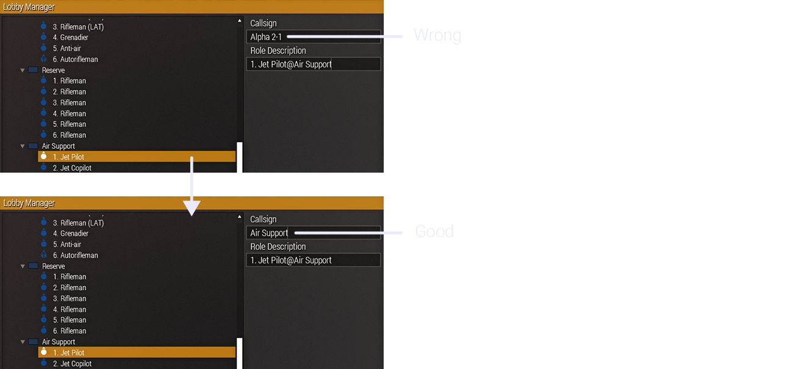
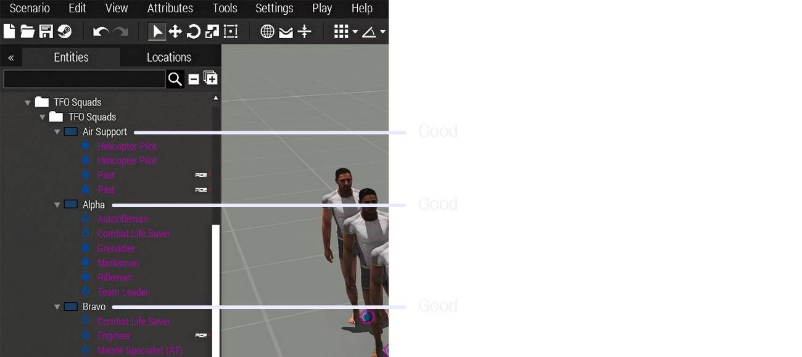

- **Change manually callsigns to every teams**
 

### Loadouts 

To avoid the use of an arsenal in-game and win time, **every slot must be completely geared out and mission ready** in compliance with the loadouts page on the main docs [**HERE**](https://docs.google.com/spreadsheets/d/1rDYccbTh8AwkFsf8eH5Uo9JXZpjnM2buKw_GWrxnPt0/edit##gid=180428066).

A time consuming but necessary step to **prevent any omission and loss of time**, so we can start the mission and have fun faster !

- **Make correct loadouts for every roles**
  

## 5. Images and templates

### Images 

Bohemia Interactive developed a file format (.paa) as the base texture file, using 2^n dimensions _(ex. 256x256, 512x512, 1024x1024…)_. Most of the files are square textures but can also be rectangle _(ex. 1024x512)_. 

If in your missions you want to use screens, panels, billboards to display images, **JPG format is also supported**. Most of the displays use 2^n rectangle dimensions, but **any 2:1 ratio image is enough** _(ex. 1000x500)_ for simple tasks like this.

To display an image on a screen, first you put the image in your mission folder. Then in Arma you go to the attributes of a display by double clicking it or right click > Attributes, all the way down you will find a text box where you put the name of the picture _(if it’s in another folder inside the mission folder, use backslashes \ for the path)_. 

 __

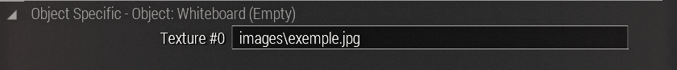

- **Set properly the path of the images**

### Templates 

You **may require a template** as some displays use a specific one.

Here are specific templates of the most commonly used ones, with a Photoshop file, and blank .jpg version :

  

     
    <tr>
		<td>
<a href="https://drive.google.com/file/d/15V-bF0Q1WTiIVGaItR0HT0fOc9wj92Lm/view?usp=sharing">Whiteboard.psd</a> </td>
		<td><a href="https://drive.google.com/file/d/1Zz28nrqgWYPPhkEvt78TRKqB7zMcU6Rj/view?usp=sharing">Whiteboard.jpg</a> </td>
	</tr>
  

  

     
    <tr>
		<td>
<a href="https://drive.google.com/file/d/12-DF7vv1pOqC1QKT7c0V1lwWTG4t4JMN/view?usp=sharing">BriefingRoomScreen.psd</a> </td>
		<td><a href="https://drive.google.com/file/d/1y-Hg6B7T8_yhhL75iYKZ7GKzZ_Ql65FN/view?usp=sharing">BriefingRoomScreen.jpg</a> </td>
	</tr>
  

- **Use correct templates if needed**

## 6. Scripts

Different scripts can be used to improve the mission and win time, here’s a few scripts used by the mission makers.

### Scripts

**Spawn :** 

When joining the server, will allow players to spawn where their character is placed in the editor, instead of using the multiplayer respawn module. 
[Download](https://drive.google.com/file/d/1OIOIKuG6hZ68lc2YQPMfYRCgzR5xkuMB/view?usp=sharing)

**Respawn :** 

When a player dies and respawn, will restore the equipment he had before dying, instead of getting a fresh loadout.  
[Download](https://drive.google.com/file/d/1D1KsDvds6GLfXN4BO-KsyMgH4SPqlQNj/view?usp=sharing)

**Flare fix :** 

Script to enhance the brightness of the flares at night, instead of using mods for this purpose. 
[Download](https://drive.google.com/file/d/1Mqms3jTJytmKhyVNp9kWISaEBtah3Ejg/view?usp=sharing)

### How to install

To install the scripts, you simply have to put them in the mission folder. Beware, **scripts must be directly put in the folder** and not in a different folder. 

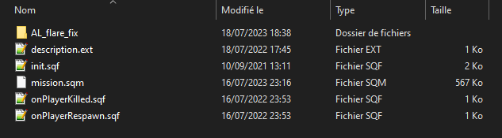

- **Set correctly scripts if needed**

## 7. Tips and tricks

### Mission making

- Keep vehicles as decoration as small as possible, as every vehicle's physics are calculated at all times and can cause performances issues
- Placing all the enemies in the editor is highly discouraged as it will cause performances issues, use zeus/script to spawn more when needed
- Decorative item/object count must be kept as small as possible. Less is more : you can do very good scenes with very few objects
- Placing reference points and objective markers are highly encouraged
- Bases are supposed to be small and easy to navigate
- Keep walking distance to vehicles to a minimum
- Turn props that can be into object to save performance
- Lock the vehicles that are not intended to be used or stolen
- Large hide terrain modules will kill the fps on servers
- Some modules won’t work properly outside the edge of the map
- Prepare a vehicle and a crate filled with everything needed for a resupply run
- Outside of the map, enemies will behave differently and see through walls
- PNG pictures are not supported, use only jpg

### Zeus 

- Delete bodies/wrecks after a fight to save performance

- Promoting someone with zeus module will make the server lag heavily 

- Large amount of pre-placed AI will cause performances issues, use zeus/script to spawn more when needed

- If you’re using Webknight zombies, don’t pre place zombies as it will make the server lag overtime

- Headless client will make AI act differently :

  - Ignore some waypoints (drop troops…)
  - Make AI move even with the path disabled
  - Impossible for you to drive and shoot at the same time will controlling an AI in a vehicle 

- **Take notes of the tips**

## 8. Testing your mission

When your mission is ready, it is **time to test it !** To make sure everything is working properly and nothing is missing.

The best would be **testing the mission a day before the op**, and not at the last minute. So if changes or corrections are needed, they are not done in a rush and make the mission start late.

Handle your mission’s .pbo and server modlist to a Server Admin so he can set it up on the server. Be patient, **it can take time** if new mods need to be downloaded. When ready, hop on the server !

### What to test ? 

- Mission is loading properly on the server, no mods are making errors 
- Everyone can join the server, if there’s enough slots
- All roles are set correctly and available
- The spawn when joining is working
- The loadouts are correctly set
- The scripts are working
- When dying, the respawn point is working 
- You have access to the zeus
- You can spawn and edit objects/units in zeus
- Triggers are working
- FPS are good and no lag kill the server

The ideal thing to do is to **play the mission yourself** so you can directly see if all the different things in the mission are available and working.

When you are done testing, **don’t forget to warn the Server Admins** so they can shut down the server if no more tests are needed.

- **Don’t test the mission last minute**
- **Test the mission from start to finish**
  

## 9. Summary

Here are short and concise points seen throughout the entire guide.

- **Test mods and compatibilities**
- **Keep modlist small as possible**
- **Use required mods**
- **Make sure modlist is well in advance available before the op**
- **Create different modlists for different uses**
- **Put Arma 3 Preset in the modlist name**
- **Set properly the mission settings**
- **Use TFO squads composition**
- **Change manually callsigns to every teams**
- **Make correct loadouts for every roles**
- **Set properly the path of the images**
- **Use correct templates if needed**
- **Take notes of the tips**
- **Don’t test the mission last minute**
- **Test the mission from start to finish**

## 10. Links (to organize)

### Youtube tutorials

### Useful links

